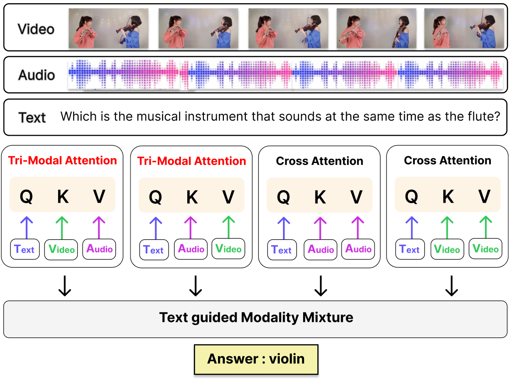

# Q-TriM: Question-Guided Tri-Modal Attention for Audio-Visual Question Answering

  <b>Accepted at ECCV 2026</b>

  <b>Authors:</b> SungHun Kim, Seungjun Baek*

  Korea University

  <a href="YOUR_PAPER_LINK">Paper</a>

  

## Overview

Q-TriM is a shallow and parallel multimodal attention framework for Audio-Visual Question Answering. It models question-guided interactions among video, audio, and text while avoiding deeply stacked sequential fusion modules.

## Highlights

* Shallow and parallel multimodal fusion for AVQA
* Text-conditioned attention over video and audio representations
* Tri-Modal Attention with Query, Key, and Value from distinct modalities
* Strong performance across three AVQA benchmarks
* Improved robustness and out-of-distribution generalization on MUSIC-AVQA-R

## Abstract

Audio-Visual Question Answering (AVQA) extends classical VQA by requiring joint reasoning over video and synchronized audio. However, many AVQA systems rely on deeply stacked layers of self- and cross attention across text, video, and audio. Such sequential stacking may incur loss of information such as subtle inter-modal cues over the layers, causing errors to accumulate across sequential attention layers during the fusion.

We introduce Q-TriM, which performs multi-modal fusion in a shallow and parallel manner instead of a deep and sequential manner. For Q-TriM, we propose a novel framework for attention operations incorporating video and audio conditioned on text. As a result, we obtain not only standard cross-attention outputs but also Tri-Modal Attention representations in which Query, Key, and Value come from distinct modalities.

These attention representations are combined in parallel at a single stage, avoiding deeply stacked multi-modal fusion and mitigating error accumulation and depth-induced issues. Q-TriM achieves state-of-the-art performance on three AVQA benchmarks, including substantial gains on MUSIC-AVQA-R, demonstrating its robustness and out-of-distribution generalization.

## Code

Code will be released soon.

